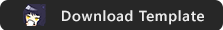

# Welcome to the **New** Python 3 Modification Club!

The **new** Python 3 DDLC Mod Template is a mod template made by Azariel Del Carmen (GanstaKingofSA) for the **original** Doki Doki Literature Club that adheres to [Team Salvato's IP Guidelines](http://teamsalvato.com/ip-guidelines/) for fan mods on Ren'Py 8.

> Additionaly [here](./CREDITS.md) are all the contributors that contributed to the mod template.

> For Ren'Py 6-7 support, see the [Python 2](https://github.com/GanstaKingofSA/DDLCModTemplate2.0/tree/python-2) branch.

### Disclaimers
   - <u>Team Salvato</u>
      > The template code/files are designed for original DDLC fan games and mods that use DDLC assets with Ren'Py. It is not meant for non-DDLC projects. The DDLC Mod Template is not afilliated in anyway with Team Salvato.
   - <u>GanstaKingofSA</u>
      > You may not use the template to make unofficial DDLC patchers, fixes, etc.

### **Credit Requirements**
You must include a name credit in your mods' credits screen and/or `credits.txt` file. Below is a example credit you may use.
   > This mod was made possible by GanstaKingofSA's DDLC Mod Template 2.0: https://github.com/GanstaKingofSA/DDLCModTemplate2.0

By default a credits screen is enabled in-game, either in the Extras screen or as a button in-game if the Extras screen is disabled.

Optional but very appreciated credits that you can also add are
   1. A custom splash screen that features the Team Salvato logo (and/or your mod logo) and a `GanstaKingofSA` logo (which can be found [here](.github/IMAGES/Logos/)).
   2. A small mention in the game's disclaimer saying that this mod was not possible without using GanstaKingofSA's mod template.
   3. A presplash screen that contains a `GanstaKingofSA` logo (which can be found [here](.github/IMAGES/Logos)).
   4. Present a custom idea to me for approval either through Discord or Reddit.

### Template Features
1. Ren'Py 8 Team Salvato Compliant Mods and Splashscreen (Disclaimer)!
3. DDLC's exact RPY files with explainations.
4. Support for macOS, Linux* and Android**!
   > \* - Linux users must run your mod via `LinuxLauncher.sh`.

   > \*\* - If your mod uses simple code or DDLC's/template built-in functions. More complex code or non-mobile friendly features may require some adjustments and changes to get working. See *Android Mod Guide.pdf* or visit the DDMC Discord for additional help.
6. Xcode Support! Open this project in Xcode and you can edit, build, and run your mod without opening the Ren'Py Launcher ever again! 
    > Note: You need to change your `RENPY_TOOL` location and the Ren'Py app location in the target scheme for Xcode. [Learn more &rsaquo;](XCODE.md)
7. [BETA] Pronoun Support! - Allow players to identify with the pronoun they go by!
    > See *mod_extras/pronouns.rpy* in the `game` folder for a example on how to use this feature.
8. Better Blue Screens of Death! - Make your own BSOD easily in-game on every OS! 
9. Uncensored Mode and Let's Play Mode! - Allow more "sensitive" content to be shown in-game and protect your IRL information while streaming/recording!
10. Gallery Menu and Achievements Menu! - Allow players to see the work you have done in-game and earn achievements for playing your mod!
12. Automatic GUI Coloring and Different Menu Button Colors! - Color the GUI and/or menu buttons in the game to whatever you like without editing the asset files themselves! 
13. Terra's in-depth Poem Game guide!
14. NVL Support thanks to Yagamirai01!
15. Patches for several Ren'Py releases and Windows features.
16. Python 3 support and code now in use!
17. [BETA] Discord Rich Presence support!
18. Dynamic Super Resolution/Dynamic Super Positions (DSR/DSP) and Custom Resolutions! - Scale positions and/or your assets higher than they usually can go and display DDLC in different resolution modes. The DDLC Mod Template is now a universal X resolution template!
19. Player Name Change! - Did you wrongly typed your name or want to change it? You can now do so very easily!
20. New Monika Console and Settings Menu! - Enjoy a easier console to type commands in and a cleaner settings UI compared to the original game.

### Returned Features
1. Ghost Menu (Dan's spooky easter egg).
2. Sayori Kill Script (plays if Sayori is deleted before the game starts).
3. Monika Kill Script (plays if Monika is deleted before a new game starts).
4. Special Poems (The random poems in DDLC that appear in Act 2) <u>[now improved!]</u>.
5. Poem Responses! (The responses the girls give you about your poem).

### Getting Started
Follow the steps listed [here](https://ganstakingofsa.github.io/information/guides/Installing-the-Mod-Template-Recent.html) in order to install the mod template.
> Once you finished writing your script, select *Build Distributions*. Uncheck all the options, check only `Ren'Py 8 DDLC Compliant Mod` and click <u>Build</u>. This will create a cross-platform *Renpy8-DDLCMod* ZIP file with your mod files.

### Getting Started For Android Porting/Modding
Refer to [*The DDLC Android Mod Guide*](./Documentation/Android%20Mod%20Guide.pdf) for more in-depth information about making your mod work on Android.
> For older templates, refer to the PDF in your templates' ZIP file as the latest guide may not match your current template.

Copyright © 2019-2023 Azariel Del Carmen (GanstaKingofSA). All rights reserved.

Doki Doki Literature Club, the Doki Doki Literature Club code, is the property of Team Salvato (Dan Salvato LLC). Copyright © 2017 Team Salvato. All rights reserved.
