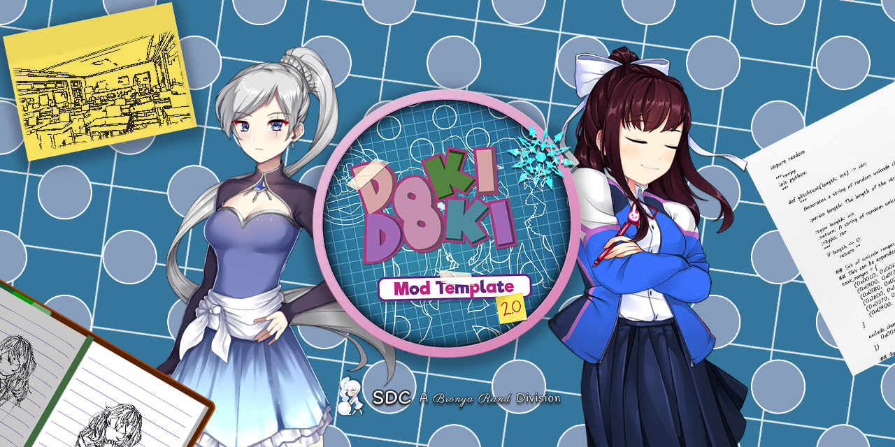
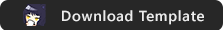

# Welcome to the **New** Modification Club!

> [!CAUTION]
> As of July 12th, 2025, Ren'Py 7 has been deprecated by RenPyTom. As such, the Python 2 version of the DDLC Mod Template will no longer be supported in the near future. All future DDLC modding should now be done on Ren'Py 8 using the **[Python 3](https://github.com/Bronya-Rand/DDLCModTemplate2.0/tree/python-3)** version of the DDLC Mod Template.

<p align="center">
  
</p>

<p align="center">
   <a href="https://github.com/Bronya-Rand/DDLCModTemplate2.0/releases/latest">
      
   </a>
   &nbsp;&nbsp;
   <a href="https://ko-fi.com/K3K22K8SU">
      
   </a>
</p>

## Table of Contents
- [📖 Overview](#-overview) 
- [📋 Credit Requirements (Important)](#-credit-requirements) 
- [✨ Features](#-features) 
- [🚀 Quick Start](#-quick-start) 
- [📦 Building & Distribution](#-building--distribution)
- [🎯 Platform-Specific Guides](#-platform-specific-guides)
- [📚 Additional Resources](#-additional-resources)
- [👏 Credits](#-credits)

## 📖 Overview

The DDLC Mod Template 2.0 is a comprehensive mod template for **Doki Doki Literature Club** that fully adheres to [Team Salvato's IP Guidelines](http://teamsalvato.com/ip-guidelines/). 

Built originally for Ren'Py 6.99.12.4 and later updated for Ren'Py 7.3.5-7.8.7, this template provides everything you need to create fan-made, cross-platform DDLC mods with ease.

**Perfect for:**
- First-time mod creators looking for a solid foundation.
- Experienced modders seeking a reliable and feature-rich template.
- Modders seeking cross-platform compatibility (Windows, macOS, Linux, Android).

> [!NOTE]
> **The DDLC Mod Template is not affiliated in any way with Team Salvato nor is it designed for the sequel "Doki Doki Literature Club Plus". Do not use the template nor its code for unofficial DDLC patches, fixes, etc.**

> [!NOTE] 
> For modern Ren'Py support (Ren'Py 8.X.X), see the [Python 3](https://github.com/Bronya-Rand/DDLCModTemplate2.0/tree/python-3) branch of the mod template.

---

## ✨ Features

### Core Features

- ✅ **Team Salvato Compliant** - Includes required splashscreen (disclaimer) and follows all IP guidelines for fan mods.
- 📚 **Original DDLC Scripts Included** - Reference the original game scripts for learning purposes.
- 🌐 **Cross-Platform Support** - Build for Windows, macOS, Linux, and Android.
- 🎨 **Automatic GUI Coloring** - Customize GUI and menu button colors without editing assets.
- 🖼️ **Dynamic Super Resolution (DSR/DSP)** - Universal resolution template supporting custom resolutions.
- 📝 **Player Name Change** - Allow players to correct or change their name in-game.
- 💬 **Enhanced Console & Poem Responses** - Improved Monika console and cleaner poem response system.

### Gameplay Features

- 🎮 **Uncensored Mode** - Option to show more sensitive content.
- 📹 **Let's Play Mode** - Protect personal information while streaming/recording.
- 📖 **NVL Support** - Full NVL (novel-style) dialogue support thanks to Yagamirai01.

### Returned DDLC Features

Classic DDLC features restored and improved:
- 👻 **Ghost Menu** - Dan's spooky easter egg.
- 💔 **Character Kill Scripts** - Sayori and Monika deletion scripts.
- 📄 **Special Poems** - Act 2 random poems.

### Optional Extras

> [!IMPORTANT]
> Download `DDLCModTemplate-X.X.X-Extras.zip` to access these optional features.

- 💥 **Better Blue Screens of Death** - Create custom BSODs on all platforms.
- 🖼️ **Gallery System** - Showcase your artwork and CGs.
- 🏆 **Achievements Menu** - Reward players for completing milestones.

---

## 🚀 Quick Start

### Prerequisites
1. **[Ren'Py 6.99.12.4](https://www.renpy.org/release/6.99.12)** or **[Ren'Py 7.8.7](https://www.renpy.org/release/7.8.7)**.
2. **[DDLC (PC Version)](https://ddlc.moe/)**.
3. **[This DDLC Mod Template](https://github.com/Bronya-Rand/DDLCModTemplate2.0/releases)**.

### Installation Steps

1. **Extract Ren'Py** to a folder of your choice.
> [!WARNING]
> Do not extract Ren'Py to a cloud storage folder (e.g. Google Drive, OneDrive, etc.) as it will cause issues when testing your mod.

2. **Create a new folder** in either the `renpy-6.99.12.4-sdk` (for Ren'Py 6) or `renpy-7.8.7-sdk` (for Ren'Py 7) folder and extract the DDLC Mod Template ZIP into it.

3. **Extract DDLC assets** - Open `DDLC-1.1.1-pc.zip` and copy these RPA files into the mod template's `game` folder:
   - `audio.rpa`
   - `fonts.rpa`
   - `images.rpa`

4. **Launch the template**
   - Open the Ren'Py Launcher.
   - Select the DDLC Mod Template project.
   - Click _Launch Project_ to test it.

🎉 You're ready to start modding!

---

## 📦 Building & Distribution

When you're ready to release your mod:

1. Open the **Ren'Py Launcher**.
2. Click on **Build Distributions**.
3. **Uncheck all options** in `Build Packages` and check either **Ren'Py 6 DDLC Compliant Mod** (for Ren'Py 6) or **Ren'Py 7 DDLC Compliant Mod** (for Ren'Py 7).
4. Click **Build**.

This creates a cross-platform mod package ZIP file (marked with `-Mod` for Ren'Py 6 or `-Renpy7Mod` for Ren'Py 7) containing your mod files ready for distribution.

> [!TIP]
> Always test your mod thoroughly before building and distributing!


---

## 🎯 Platform-Specific Guides

### Android

Making your mod work on Android requires additional considerations, especially for complex features or non-mobile-friendly code.

📱 **Read the full guide:** [Android Mod Guide](./Documentation/Android%20Mod%20Guide.pdf)

> [!NOTE]
> For older templates, refer to the PDF included in your template's ZIP file as the latest guide may not match your version.

### Linux

Linux users must run mods using the included launcher script (at least once):

```bash
./LinuxLauncher.sh
```

### macOS

macOS support is included out of the box. Build distributions include macOS packages automatically.

---

## 📋 Credit Requirements

> [!IMPORTANT]
> **You MUST credit this template in your mod.** By default, a credits screen is enabled in-game (either in the Extras screen or as a standalone button). You can use the default implementation or choose one of the alternatives below.

### Default Credit Text

Include this in your mod's credits screen and/or `credits.txt` file:

```
This mod was made possible by bronya_rand's DDLC Mod Template 2.0: https://github.com/Bronya-Rand/DDLCModTemplate2.0
```

### Alternative Credit Methods

If you prefer a different approach, you may use one of these alternatives:

1. **Custom Splash Screen** - Feature the Team Salvato logo alongside a Bronya Rand logo ([available here](.github/IMAGES/Logos/)).
2. **Disclaimer Mention** - Add a line to your game's disclaimer: "This mod was made possible using bronya_rand's mod template".
3. **Presplash Screen** - Include a Bronya Rand logo ([available here](.github/IMAGES/Logos)) in your presplash.
4. **Custom Idea** - Contact me via Discord or Reddit with your proposed credit method for approval.

---

## 📚 Additional Resources

### Documentation

- 📱 [Android Mod Guide](./Documentation/Android%20Mod%20Guide.pdf) - Complete guide for Android porting
- 📝 [New Poem Game Guide](./Documentation/New%20Poemgame%20Guide.pdf) - In-depth poem game documentation

### Community & Support

- 💬 **DDMC Discord** - Get help and share your mods with the community
- ☕ **Support Development** - [Buy me a Ko-fi](https://ko-fi.com/K3K22K8SU)

---

## 👏 Credits

Thanks to the following people for their contributions to the DDLC Mod Template:

> [!NOTE]
> This list goes from the past to present.

- Dan Salvato (DDLC)
- renpytom (Ren'Py)
- MAS Team (template base before revamping)
- alicerunsonfedora (Xcode)
- Terra (In-depth poem game)
- Yagamirai01 (NVL)
- Alexxonder (Auto Color Adjustments)
- Elckarow (Python 3 updates, New poem responses/effects)
- NekoLaiS (Cryllic compatibility)
- The DDMC Community (Feature suggestions and feedback)
- Pseurae (Donation/Act 3 GL2 Fix)
- Lezalith (New Console (4.1.1+))
- RS/6000 (New Mod Template Logo (4.2.1+))
- Tulkas (Android Gestures)
- FiT (Weiss Chibi Branding Icon Design)

---

<p align="center">
   <b>Copyright © 2019-2025 Azariel "Bronya Rand" Del Carmen (bronya_rand). All rights reserved. Doki Doki Literature Club, the Doki Doki Literature Club code, is the property of Team Salvato. Copyright © 2017 Team Salvato. All rights reserved.</b>
</p>
