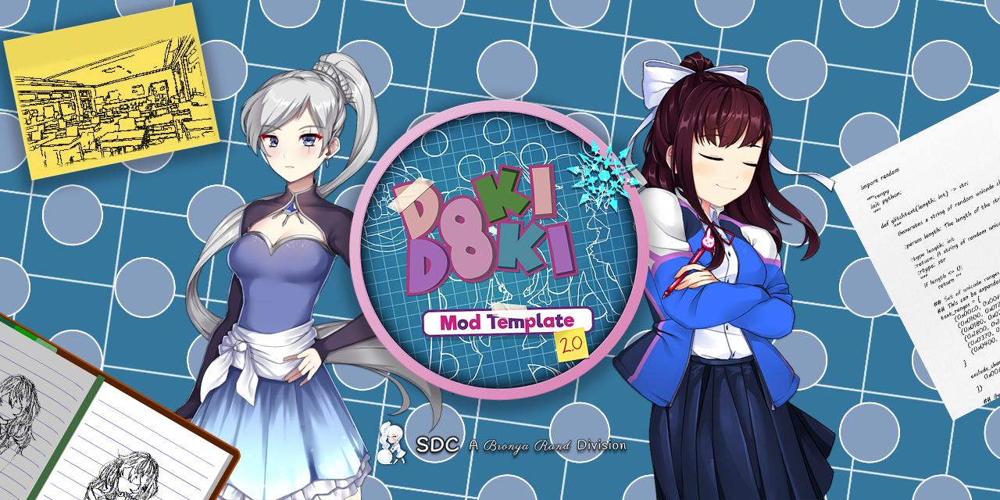
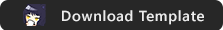

# Welcome to the **New** Modification Club!

> [!CAUTION]
> As of October 5th, 2026, the 5.1.0 update of the DDLC Mod Template is the **final** version that ships with the Python 2 version of the Mod Template. There will be no more support outside of specific bugfixes on the Python 2 branch. All future DDLC modding should now be done on Ren'Py 8 using the **[Python 3](https://github.com/Bronya-Rand/DDLCModTemplate2.0/tree/python-3)** version of the DDLC Mod Template.

<p align="center">
  
</p>

<p align="center">
   <a href="https://github.com/Bronya-Rand/DDLCModTemplate2.0/releases/latest">
      
   </a>
</p>

## Table of Contents
- [Overview](#overview) 
- [Credit Requirements](#credit-requirements) 
- [Features](#features) 
- [Quick Start](#quick-start) 
- [Building & Distribution](#building--distribution)
- [Platform-Specific Notes](#platform-specific-notes)
- [Additional Resources](#additional-resources)
- [Credits](#credits)

## 📖 Overview

The DDLC Mod Template 2.0 is a comprehensive mod template for **Doki Doki Literature Club** by Azariel Del Carmen (bronya_rand) that fully adheres to [Team Salvato's IP Guidelines](http://teamsalvato.com/ip-guidelines/). 

Built originally for Ren'Py 6.99.12.4 and later updated for Ren'Py 7.3.5-7.8.7, this template provides everything you need to create fan-made, cross-platform DDLC mods with ease.

> [!NOTE]
> **The DDLC Mod Template is not affiliated in any way with Team Salvato nor is it designed for "Doki Doki Literature Club Plus." Do not use the template nor its code for unofficial DDLC patches, fixes, etc.**

---

## Features

### Core Features

- **Team Salvato Compliant** - Includes required splashscreen (disclaimer) and adheres to all IP guidelines for fan mods.
- **Original DDLC Scripts Included** - Reference the original game scripts for learning purposes.
- **Cross-Platform Support** - Build for Windows, macOS, Linux, and Android.
- **Automatic GUI Coloring** - Customize GUI and menu button colors without editing assets.
- **Dynamic Super Resolution (DSR/DSP)** - Universal resolution template supporting custom resolutions.
- **Player Name Change** - Allow players to correct or change their name in-game.
- **Enhanced Console & Poem Responses** - Improved Monika console and cleaner poem response system.

### Gameplay Features

- **Uncensored Mode** - Option to show more sensitive content.
- **Let's Play Mode** - Protect personal information while streaming/recording.
- **NVL Support** - Full NVL (novel-style) dialogue support thanks to Yagamirai01.

### Returned DDLC Features

Classic DDLC features restored and improved:
- **Ghost Menu** - Dan's spooky easter egg.
- **Character Kill Scripts** - Sayori and Monika deletion scripts.
- **Special Poems** - Act 2 random poems _(now improved!)_.

### Optional Extras

> [!IMPORTANT]
> Download `DDLCModTemplate-X.X.X-Py2Extras.zip` to access these optional features.

- **Better Blue Screens of Death** - Create custom BSODs on all platforms.
- **Gallery System** - Showcase your artwork and CGs.

---

## Quick Start
> [!NOTE]
> As of late 2026, Ren'Py 6.99.12.4 is no longer compatible with the latest version of the Mod Template. It is recommended to use either Ren'Py 7.8.7 or move to the **[Python 3 branch](https://github.com/Bronya-Rand/DDLCModTemplate2.0/tree/python-3)**.

### Prerequisites
1. **[Ren'Py 7.8.7](https://www.renpy.org/release/7.8.7)**.
2. **[DDLC (PC Version)](https://ddlc.moe/)**.
3. **[This DDLC Mod Template](https://github.com/Bronya-Rand/DDLCModTemplate2.0/releases)**.

### Installation Steps

1. **Extract Ren'Py** to a folder of your choice.
> [!WARNING]
> Do not extract Ren'Py to a cloud storage folder (e.g. Google Drive, OneDrive, etc.) as it will cause issues when testing your mod.

2. **Create a new folder** in the `renpy-7.8.7-sdk` folder and extract the DDLC Mod Template ZIP into it.

3. **Add the DDLC PC assets** - Open `ddlc-win.zip` and copy these RPA files into the mod template's `game` folder:
   - `audio.rpa`
   - `fonts.rpa`
   - `images.rpa`

4. **Extract DDLC's RPA files** *(optional)*
   > Skip this if you are not planning to release your mod on Android.

   Using `unrpa`, extract the RPAs files you copied into the mod template's `game` folder into the game folder itself.

5. **Launch the template**
   - Open the Ren'Py Launcher.
   - Select the DDLC Mod Template project.
   - Click _Launch Project_ to test it.

🎉 You're ready to start modding!

---

## Building & Distribution

When you're ready to release your mod:

### PC, macOS, and Linux

1. Open the **Ren'Py Launcher**.
2. Click on **Build Distributions**.
3. Under `Build Packages`, **uncheck everything** except **Ren'Py 7 DDLC Compliant Mod**.
4. Click **Build**.

This creates a cross-platform mod package ZIP file (marked with `-Renpy7Mod` in the filename) containing your mod files ready for distribution.

### Android

1. Open the **Ren'Py Launcher**.
2. Click on **Android**. The first time, this downloads RAPT (Ren'Py Android Packaging Tools). Once it finishes, click **Android** again.
4. Click on **Install SDK** to install the Android SDK (this may take a while).
5. Click on **Generate Keys** to generate a new Android Keystore.
5. Click **Configure** to set up your mod's Android configuration.
6. When prompted to select an app store, choose **Neither**.
7. Click **Build Package**.

> [!NOTE]
> Choose *Neither* because Team Salvato's IP Guidelines disallow mods on Google Play and the Amazon Appstore.

> [!TIP]
> If Gradle runs out of memory during the build, allocate more RAM in the configuration step. 3 GB is usually enough, but large mods may need more.

This creates an APK containing your mod files along with the game's own files.

> [!TIP]
> Always test your mod thoroughly before building and distributing!

---

## Platform-Specific Notes

### Linux

Linux users must run mods using the included launcher script (at least once):

```bash
./LinuxLauncher.sh
```

### macOS

macOS support is included out of the box. Build distributions include macOS packages automatically.

---

## Credit Requirements

> [!IMPORTANT]
> **You MUST credit this template in your mod.** By default, a credits screen is enabled in-game (either in the Extras screen or as a standalone button). You can use the default implementation or choose one of the alternatives below.

### Default Credit Text

Include this in your mod's credits screen and/or `credits.txt` file:

```
This mod was made possible by bronya_rand's DDLC Mod Template 2.0: https://github.com/Bronya-Rand/DDLCModTemplate2.0
```

### Alternative Credit Methods

If you prefer a different approach, you may use one of these alternatives:

1. **Custom Splash Screen** - Feature the Team Salvato logo alongside a Bronya Rand logo ([available here](.github/IMAGES/Logos/)).
2. **Disclaimer Mention** - Add a line to your game's disclaimer: "This mod was made possible using bronya_rand's mod template".
3. **Presplash Screen** - Include a Bronya Rand logo ([available here](.github/IMAGES/Logos)) in your presplash.
4. **Custom Idea** - Contact me via Discord or Reddit with your proposed credit method for approval.

---

## Additional Resources

### Documentation

- 📝 [New Poem Game Guide](./Documentation/New%20Poemgame%20Guide.pdf) - In-depth poem game documentation

### Community & Support

- 💬 **DDMC Discord** - Get help and share your mods with the community
- 🐛 **Issues** - Report bugs on [GitHub Issues](https://github.com/Bronya-Rand/DDLCModTemplate2.0/issues)
- ☕ **Support Development** - [Buy me a Ko-fi](https://ko-fi.com/K3K22K8SU)

---

## Credits

Thanks to the following people for their contributions to the DDLC Mod Template:

> [!NOTE]
> This list goes from the past to present.

- Dan Salvato (DDLC)
- renpytom (Ren'Py)
- MAS Team (template base before revamping)
- alicerunsonfedora (Xcode)
- Terra (In-depth poem game)
- Yagamirai01 (NVL)
- Alexxonder (Auto Color Adjustments)
- Elckarow (Python 3 updates, New poem responses/effects)
- NekoLaiS (Cryllic compatibility)
- The DDMC Community (Feature suggestions and feedback)
- Pseurae (Donation/Act 3 GL2 Fix)
- Lezalith (New Console (4.1.1+))
- RS/6000 (New Mod Template Logo (4.2.1+))
- Tulkas (Android Gestures)
- FiT (Weiss Chibi Branding Icon Design)
- Retronika (Supplemental code for the Gallery system)

---

<p align="center">
   <b>Copyright © 2019-2026 Azariel "Bronya Rand" Del Carmen (bronya_rand). All rights reserved. Doki Doki Literature Club, the Doki Doki Literature Club code, is the property of Team Salvato. Copyright © 2017 Team Salvato. All rights reserved.</b>
</p>
